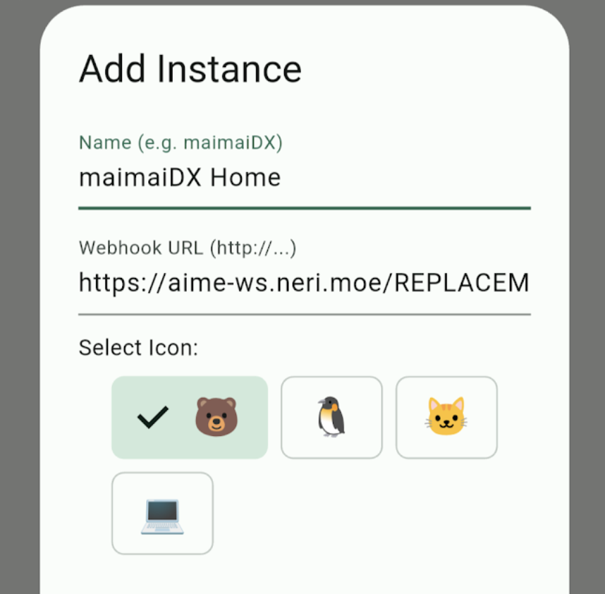

### [English Guide](README_en.md)

# HINATA Go
配合 HINATA AimeIO 让你的手机变成刷卡器或扫码游玩家用街机游戏，并可以与各种其他设备协同使用。

## 下载

| iOS | Android |
| --- | ------- |
| [](https://apps.apple.com/app/id6760301105) | [**APK 下载**](https://github.com/nerimoe/hinata_go/releases) |

## 基础功能

* 读取卡片信息
* 连接游戏作为读卡器
* HINATA 读卡器配置 & 更新

## 读取卡片信息

将卡片置于移动设备NFC识别区域，即可读取卡片信息

现已可使用 移动设备USB-OTG接口 连接 **HINATA 读卡器** 作为外部读卡器

### 目前可读取卡片类型

* **Amusement IC**
* **旧版 Aime**
* **Bana Passport**
* **E-Amusement Pass**
* **FeliCa**

## 连接游戏作为读卡器

### Segatools
> **以下配置均以 HINATA 公共刷卡服务器 ( `aime-ws.neri.moe` ) 为例，请确保你的网络环境可以正常访问 Cloudflare 的服务**
1. 首先在你的游戏部署 [HINATA AimeIO](https://hinata.neri.moe/game-setting/sega/hinata-client/) ，然后配置远程刷卡服务器，使用文本直接编辑或使用 HINATA Client 图形化编辑均可
    ```ini
    [aime]
    enable=1

    [aimeio]
    path=hinata.dll
    serverUrl=wss://aime-ws.neri.moe/REPLACEME
    ```
    

    **将 `REPLACEME` 替换为你自定义的一串英文字符串，并确保够唯一，否则可能会和他人重复**
2. 在 [Release](https://github.com/nerimoe/hinata_go/releases) 内下载最新版本的 HINATA Go，安装并打开
3. 在软件内添加一个 Instance，名称自定义，URL 则配置为 `https://aime-ws.neri.moe/REPLACEME`，如图所示：

4. 打开游戏开始玩？！

### SpiceAPI
> **⚠️ 目前尚未搭建SpiceAPI的转发服，所以只能局域网使用，当然你也可以使用cloudflared自行转发**
1. 打开 `spicecfg.exe`
2. 找到 spiceapi 的配置项，设置port，密码留空
3. 在 HINATA Go 内添加一个Instance，URL配置为 `你电脑IP:Spice监听端口`，例如 `192.168.0.114:1145`，不需要带 `http://`

## HINATA 读卡器配置 & 更新

通过 移动设备USB-OTG接口 连接 HINATA 读卡器

在 HINATA Go 下方连接设备后，即可进行**配置**及**固件更新**


## 关于一些小特色功能

* 依托于公共刷卡服务器，手机和游戏机在不同网络环境下也可以正常使用
* 可以通过二维码获取卡号并传入游戏
* Amusement IC 卡片也受到完整支持
* 依托于 HINATA AimeIO ，HINATA Go 也可以实现正常读取旧版 Banapass，前提是你使用受支持的 segatools。
* 同样依托于 HINATA AimeIO，实现与回车刷卡共存，与实体读卡器共存，依托于 dllMux 功能与手台，amnet，mageki等各种其他刷卡方案共存
* 可通过 Android 系统的 Intent 来刷卡拉起该应用，快速向目标实例发送卡号
* 完整的符合 Material Design 3 的 UI 与图标


## 交流群
[QQ 1085979135](https://qun.qq.com/universal-share/share?ac=1&authKey=YzIhakJWJ7BmvG%2F1JJLr27LFwpC050aWFeatFIjOhQM0i5RgEOVVZHuDop7nvlV%2F&busi_data=eyJncm91cENvZGUiOiIxMDg1OTc5MTM1IiwidG9rZW4iOiJHOHEwYmlqYWNyakJaeDlGQ1B2Mm5TUUNCUTZESUo2cGtpWUZwZEkrSVAyOTJwUmNsWWFnckd5NmdvMDJhMWtGIiwidWluIjoiMTAxNTkyOTQ1MiJ9&data=Dp-q7I-pDdniotBs8a4b6u7WM2CuxwRxphBKcVkxtF_IB8A1xp4oKNytX9NglpUJcpD0wc2hjgP4dIF4-7xpkw&svctype=4&tempid=h5_group_info)

